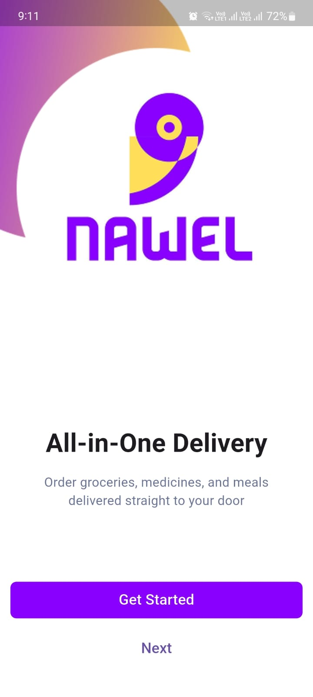
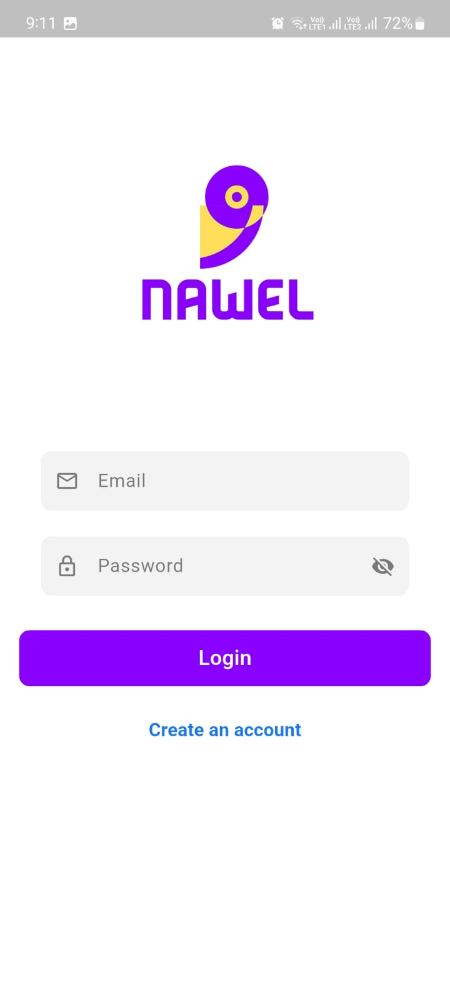
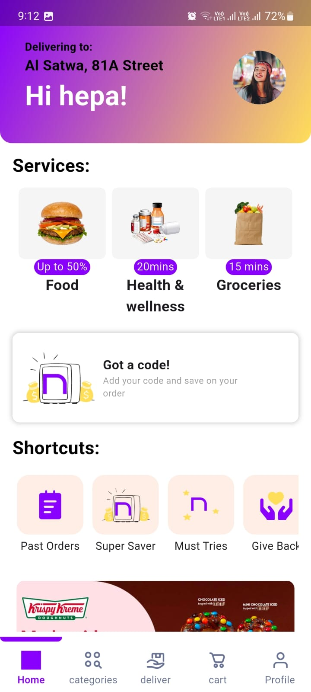

# Nawel E-Commerce App 🛒

A modern, feature-rich e-commerce mobile application built with Flutter, implementing clean architecture principles and robust state management.

## 📱 Screenshots

<!-- Add your screenshots here -->
| Splash Screen | Onboarding | Login | Home |
|---------------|------------|-------|------|
|  |  |  |  |

## ✨ Features

### Core Features
- **Splash Screen** - Elegant app introduction with branding
- **Onboarding Screens** - Interactive user guidance for first-time users  
- **Authentication System** - Secure login and sign-up functionality
- **Home Screen** - Product discovery and featured items display
- **Navigation System** - Bottom navigation with Cart, Profile, Categories, and Delivery sections

### Technical Features
- **Offline Support** - Local data caching with Hive
- **Responsive Design** - Adaptive UI for different screen sizes
- **State Management** - BLoC pattern for predictable state handling
- **Clean Architecture** - Organized, maintainable, and scalable codebase
- **Firebase Integration** - Authentication and cloud storage

## 🏗️ Architecture

This project follows **Clean Architecture** principles, ensuring separation of concerns and maintainability.

```
lib/
├── core/
│   ├── app_router/          # Navigation and routing logic
│   ├── firebase/            # Firebase configuration and services
│   ├── helper/              # Utility functions and helpers
│   ├── shared_widgets/      # Reusable UI components
│   └── utils/               # Constants, themes, and utilities
├── features/
│   ├── authentication/      # Login, signup, and auth logic
│   │   ├── data/           # Data sources, repositories
│   │   ├── domain/         # Entities, use cases
│   │   └── presentation/   # UI, BLoC, screens
│   ├── home/               # Home screen and related features
│   │   ├── data/
│   │   ├── domain/
│   │   └── presentation/
│   ├── onboarding/         # Onboarding screens
│   ├── cart/               # Shopping cart (navigation placeholder)
│   ├── profile/            # User profile (navigation placeholder)
│   ├── categories/         # Product categories (navigation placeholder)
│   └── delivery/           # Delivery tracking (navigation placeholder)
└── main.dart               # App entry point
```

## 🛠️ Tech Stack

### Framework & Language
- **Flutter** - Cross-platform mobile development
- **Dart** - Programming language

### State Management
- **BLoC (flutter_bloc)** - Business Logic Component pattern
- **Equatable** - Value equality for Dart classes

### Local Storage
- **Hive** - Fast, lightweight NoSQL database
- **Shared Preferences** - Simple key-value storage

### Backend & Authentication
- **Firebase Core** - Firebase SDK initialization
- **Firebase Auth** - User authentication
- **Cloud Firestore** - NoSQL cloud database

### UI & Navigation
- **Flutter ScreenUtil** - Responsive design utilities
- **Go Router** - Declarative routing solution
- **Carousel Slider** - Image and content carousels

## 📦 Dependencies

```yaml
dependencies:
  flutter_screenutil: ^5.9.3
  carousel_slider: ^5.1.1
  shared_preferences: ^2.5.3
  go_router: ^15.2.0
  firebase_core: ^3.14.0
  firebase_auth: ^5.6.0
  flutter_bloc: ^9.1.1
  cloud_firestore: ^5.6.9
  equatable: ^2.0.7
  hive: ^2.2.3
```

## 🚀 Getting Started

### Prerequisites
- Flutter SDK (latest stable version)
- Dart SDK
- Android Studio / VS Code
- Firebase project setup

### Installation

1. **Clone the repository**
   ```bash
   git clone https://github.com/yourusername/nawel-ecommerce-app.git
   cd nawel-ecommerce-app
   ```

2. **Install dependencies**
   ```bash
   flutter pub get
   ```

3. **Firebase Setup**
   - Create a new Firebase project
   - Add your Android/iOS app to the Firebase project
   - Download and add `google-services.json` (Android) and `GoogleService-Info.plist` (iOS)
   - Enable Authentication and Firestore in Firebase Console

4. **Run the app**
   ```bash
   flutter run
   ```

### Configuration

No additional configuration required beyond standard Flutter setup and Firebase integration.

## 🏛️ Project Structure Details

### Core Layer
- **App Router**: Centralized navigation management using GoRouter
- **Firebase**: Configuration and service initialization
- **Helper**: Utility functions and common operations
- **Shared Widgets**: Reusable UI components across features
- **Utils**: Constants, themes, and utility classes

### Features Layer
Each feature follows Clean Architecture with three layers:
- **Data**: Repository implementations, data sources, models
- **Domain**: Business logic, entities, use cases
- **Presentation**: UI screens, BLoC state management, widgets

### State Management Pattern
- **BLoC**: Business Logic Components for state management
- **Events**: User interactions and external triggers
- **States**: UI state representations
- **Repositories**: Data access abstraction

## 🎯 Key Implementation Highlights

### Authentication Flow
- Firebase Authentication integration
- Email/password registration and login
- User session management
- Secure logout functionality

### Local Storage Strategy
- **Hive**: Fast local database for offline functionality
- **Shared Preferences**: User preferences and settings
- **Caching**: Restaurant data and user preferences caching

### Responsive Design
- **ScreenUtil**: Consistent sizing across devices
- **Adaptive layouts**: Optimized for various screen sizes
- **Material Design**: Following Google's design principles

### Navigation Architecture
- **GoRouter**: Type-safe, declarative routing
- **Bottom Navigation**: Intuitive app navigation
- **Deep Linking**: Support for external navigation

## 🔄 State Management Flow

```
UI Event → BLoC → UseCase → Repository → Data Source
    ↑                                         ↓
   UI ← BLoC ← State ← UseCase ← Repository ← Response
```

## 🎨 Design Patterns Used

- **Clean Architecture**: Separation of concerns
- **Repository Pattern**: Data access abstraction
- **BLoC Pattern**: Predictable state management
- **Dependency Injection**: Loose coupling between layers
- **Single Responsibility**: Each class has one job

## 🚧 Current Status

### Completed Features ✅
- Splash screen with branding
- Multi-screen onboarding flow
- User authentication (login/signup)
- Home screen with product display
- Navigation structure setup
- Local storage implementation
- Responsive design system

### Planned Enhancements 🔄
- Complete cart functionality
- User profile management
- Product categories browsing
- Delivery tracking system
- Search and filtering
- Push notifications
- Payment integration

## 🤝 Contributing

This project is part of a Flutter internship task. For educational purposes and code review.

## 📱 Supported Platforms

- ✅ Android
- ✅ iOS

## 📋 Requirements

- **Minimum SDK**: Android 21+ / iOS 11+
- **Flutter**: 3.0+
- **Dart**: 2.17+

## 🏆 Learning Outcomes

This project demonstrates proficiency in:
- Flutter mobile development
- Clean Architecture implementation
- State management with BLoC
- Firebase integration
- Local storage solutions
- Responsive design principles
- Navigation patterns
- Code organization and structure

## 📞 Contact

For questions or feedback regarding this internship project, please reach out through the appropriate channels.

---

**Built with ❤️ using Flutter**

*This project showcases modern mobile development practices and architectural patterns suitable for scalable e-commerce applications.*
